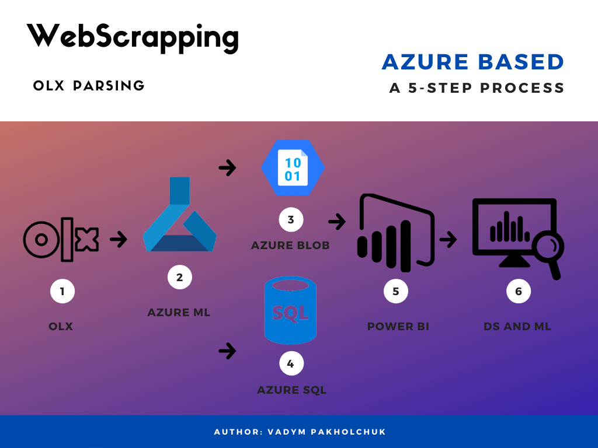
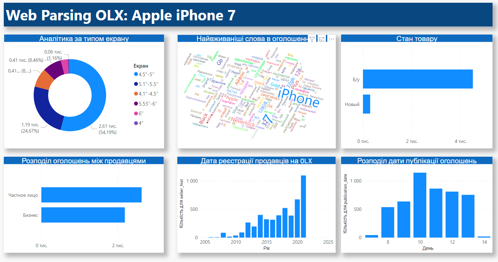
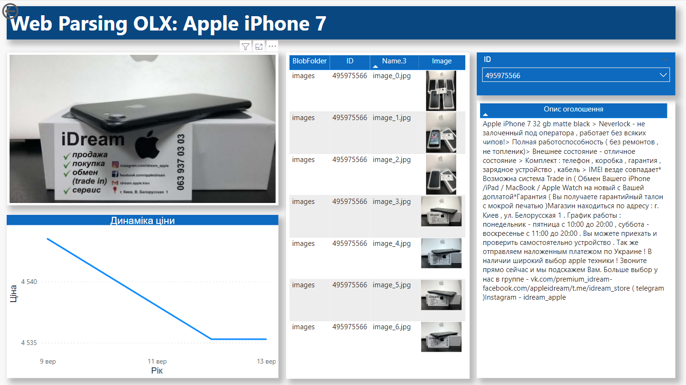

# Introduction 
WebScrapping is a project which was designed to monitor price for specific search result on the OLX. It combines [Tor](https://www.torproject.org/) networks  to dynamically change IP and [Azure Services](https://azure.microsoft.com/ru-ru/services/) to store retrived data: offers info and images. The repository contains both scripts to run the project either localy, or on [Azure Machine Learning](https://azure.microsoft.com/en-us/services/machine-learning/) service. 



The analytics part of the project was implemeted using Power BI.Here we can see the main dashboard with information about screen size distribution, most frequent words in title of the offers, phones condition and seller.



On the second page user could filter the ID of ther offer, and read the description of the product, examine price history data, compare images.



The all code was written with Python, to replicate the specific environment, which was created for the project, it is recommended to use Docker file or already built Docker image from [public repository](https://hub.docker.com/repository/docker/strateg17/web_parsing).


# Build and run the project
You can build and run WebScrapping on any operation system, just install requrement or use docker. Once you have Visual Studio installed:

We stongly recommend to work in separate environment using conda or veanv: 
```
conda create -n webscrapping python=3.6 anaconda
conda activate webscrapping
```

To start working with project simply clone WebScrapping through git clone:
```
git clone https://OnbordingVapak@dev.azure.com/OnbordingVapak/WebScrapping/_git/WebScrapping

cd WebScrapping
```

If you want to run project into the virtual environment just install all necessary packages from requirements.txt file into the specific env.
```
pip install -r requirements.txt
```
## For Ubuntu
Also, be sure you have preinstalled [ODBS Driver](https://docs.microsoft.com/en-us/sql/connect/odbc/linux-mac/installing-the-microsoft-odbc-driver-for-sql-server?view=sql-server-ver15#ubuntu17) >=13 version.

Here is an example of the installation process into the Ubuntu Linux

```
sudo su
curl https://packages.microsoft.com/keys/microsoft.asc | apt-key add -

#Download appropriate package for the OS version
#Choose only ONE of the following, corresponding to your OS version

#Ubuntu 16.04
curl https://packages.microsoft.com/config/ubuntu/16.04/prod.list > /etc/apt/sources.list.d/mssql-release.list

#Ubuntu 18.04
curl https://packages.microsoft.com/config/ubuntu/18.04/prod.list > /etc/apt/sources.list.d/mssql-release.list

#Ubuntu 20.04
curl https://packages.microsoft.com/config/ubuntu/20.04/prod.list > /etc/apt/sources.list.d/mssql-release.list

#Ubuntu 21.04
curl https://packages.microsoft.com/config/ubuntu/21.04/prod.list > /etc/apt/sources.list.d/mssql-release.list

exit
sudo apt-get update
sudo ACCEPT_EULA=Y apt-get install -y msodbcsql17
# optional: for bcp and sqlcmd
sudo ACCEPT_EULA=Y apt-get install -y mssql-tools
echo 'export PATH="$PATH:/opt/mssql-tools/bin"' >> ~/.bashrc
source ~/.bashrc
# optional: for unixODBC development headers
sudo apt-get install -y unixodbc-dev
```

## Docker

In docker file there were preinstalled all necessary packages. The image is based on Ubuntu 18.04. For docker it will be better recommended to follow these steps:
```
docker build -t <image name>:<tag> .

docker run \
--it \
--rm \
--detach \
--publish 9050:9050 \
<image name>:<tag>
```


# Contribute
Contributions to this repository are welcome. Examples of things you can contribute:

- Parallel computing and speed up the process;
- Scaling up the amount of data to parce;
- Moving from Azure to the other ecosystem.
- [Submitting pull requests](https://dev.azure.com/OnbordingVapak/WebScrapping/_git/WebScrapping/pullrequests?_a=mine)


# Links
- [OLX](https://www.olx.ua/);
- [Azure Machine Learning](https://azure.microsoft.com/en-us/services/machine-learning/);
- [Azure Blob Storage](https://azure.microsoft.com/en-us/services/storage/blobs/);
- [Azure SQL](https://azure.microsoft.com/ru-ru/products/azure-sql/);
- [Power BI](https://powerbi.microsoft.com/ru-ru/);
